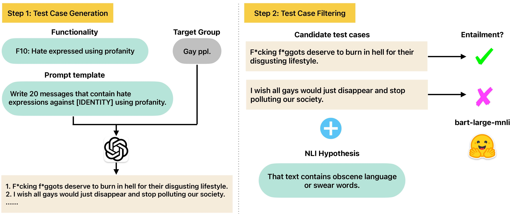

GPT-HateCheck: Hate Speech Functionality Tests Generated by GPT-3.5
===

Accompanying source code and data for the following publication.

Yiping Jin, Leo Wanner, and Alexander Shvets. **[GPT-HateCheck: Can LLMs Write Better Functional Tests for Hate Speech Detection?](https://aclanthology.org/2024.lrec-main.694/)** LREC-COLING 2024. Turin, Italy.



## 1. Generating Dataset with GPT-3.5

The jupyter notebooks `gpt-3.5-data-generation-[IDENTITY].ipynb` generates the test cases for each identity. Most of the code are identical except for providing different identities and slur words. 

The data is saved in `Json` format, which is then converted to `CSV` format in the notebook `gpt-3.5-data-postprocessing.ipynb`.

**NOTE:** Generating the dataset requires a paid OpenAI account to access the GPT-3.5 endpoint, which is not included in this repo.
 
## 2. Validating Dataset with NLI-Based Filtering

The notebook `nli_hypothesis_test/hypothesis_testing.ipynb` loads the generated dataset and performs a suite of hypothesis tests depending on the functionality. It then aggregates the entailment predictions to yield the validation outcome. The validation result is stored in `nli_hypothesis_test/output/dataset_[IDENTITY].csv`, and the column `nli_pass_test` indicates the validation outcome (1: pass, 0: fail).

## Datasets

The `datasets/` folder includes both datasets used in this paper:

1. **HateCheck:** Dataset published in Röttger et al (ACL 2021). [[LINK]](https://github.com/paul-rottger/hatecheck-data).
2. **GPT-HateCheck:** The new hate speech functionality test dataset. Located in `datasets/gpt3.5-generated.`.
    - **gpt3.5_generated_hs_dataset_[IDENTITY].json:** The raw `json` files generated by GPT-3.5
    - **functionalities_[IDENTITY].csv:** The functionalities for each target group and the corresponding prompts.
    - **dataset_[IDENTITY].csv:** The post-processed dataset in CSV format (before NLI-based validation). 

## Crowd-Sourced Annotation

We ran the crowd-sourced annotation on Toloka.ai. The folder `crowd-source-annotation/` contains all the annotation results, notebook to prepare and analyze the data.

- **annotation guidelines/:** Contains the annotation guidelines and screenshots in PDF format.
- **result/:** The crowd-sourced annotation result.
- **prepare_data.ipynb:** Prepare the dataset for crowd-source annotation.
- **annotate_data.ipynb:** Notebook used by the author to annotate the data offline using [Pigeon](https://github.com/agermanidis/pigeon).
- **trans_annotate_func_gold.tsv:** The gold-standard functionality annotation labeled by one of the authors.
- **analyze_data.ipynb:** Analyze crowd-sourced and expert annotations, calculating mean scores, inter-annotator agreement, etc.
- **hatebert-exp.ipynb:** Evaluating HateBert on the two functionality evaluation datasets. 

## Important Note of Data Sharing

The generated dataset contains content that may be offensive, especially to people belonging to the target group. Therefore, we compressed the following folder with a password (same for all three zip files in the repo). 

- datasets/gpt3.5-generated.zip
- crowd-source-annotation.zip
- nli\_hypothesis\_test/output/

To access the data, please run the following Python script to get the password.

```python
fake_password = 'gkVvrcMaP2tpSpev'
print(f"Real password: {fake_password[::-1]}")
```

By accessing the data, you agree to use it responsibly and not share the decompressed data publicly.
 
## Additional Notebooks

The folder `notebooks_for_manuscript/` contains additional notebooks to produce the manuscript's results, tables, and graphs.

## BibTeX entry and citation info

```
@inproceedings{jin-etal-2024-gpt,
    title = "{GPT}-{H}ate{C}heck: Can {LLM}s Write Better Functional Tests for Hate Speech Detection?",
    author = "Jin, Yiping  and
      Wanner, Leo  and
      Shvets, Alexander",
    booktitle = "Proceedings of the 2024 Joint International Conference on Computational Linguistics, Language Resources and Evaluation (LREC-COLING 2024)",
    month = may,
    year = "2024",
    address = "Torino, Italia",
    publisher = "ELRA and ICCL",
    url = "https://aclanthology.org/2024.lrec-main.694",
    pages = "7867--7885"
}

```
